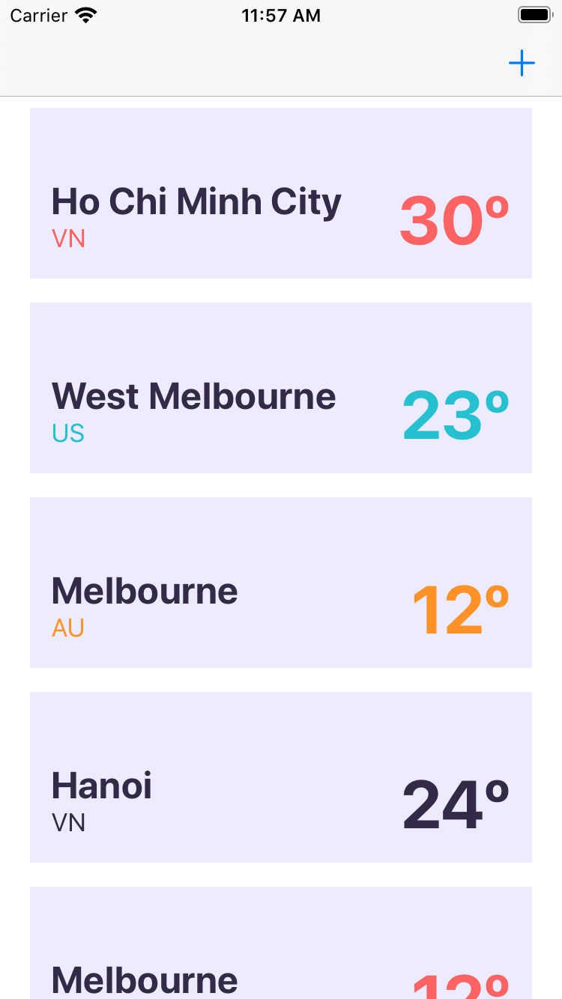

# Code assessment

## Requirement

Develop a simple app, which lets users add and view current weather based on the list of cities user added.

Initially, users will have 3 cities: Sydney, Melbourne and Brisbane. Users can add or remove city.

Screenshots:

## Some important notes
- Not blocking user interaction when calling API requests.
- Persist user selection by storing data in database.
- Fetch new weather data for each city in period timer. This is managed in `WeatherManager` class.

## Solution
### Run non-UI specific tasks in background thread
`QueueManager` is the class used to managed operations, which run on background threads. In this class, its property `OperationQueue` will manage to run the operations in multiple threads. We can also configure `QueueManager` to run how many concurrent tasks.

Apart from `QueueManager`, we have `BaseOperation` class. This is the base class to define how an operation is executed, and when it is finished based on the `State`. Normally, a basic operation will finish when function `main` is finished. However, using this approach, when a URL operation executes, the `main` function will finish before the URL request returns response. Therefore, we need to define our own `State` to manually define the case when operation finish executing.

Therefore, when we subclass `BaseOperation` and override the function `main`, we need to call `copmlete` function, to tell the `QueueManager` that this operation is finished, so the `QueueManager` can execute other operations.

To run other tasks after the operations finish (like updating the UI, or view model), `BaseOperation` has `completionHandler` return the `Result` of that operation.

### Fetching data from API and store in Core Data.
`JSONCoreDataRequestOperation` is the class used to fetch Weather data from API, and it will store the updated weather data to Core Data.

Using this approach will help in case user reopen the application. User will see the stored weather data in database.

### `WeatherManager` to manage period timer to call latest weather data.
We can change the timer interval by changing the value in `Constants.timeIntervalRequest`. When user add/remove cities, the timer for these cities also add/remove in `WeatherManager`
